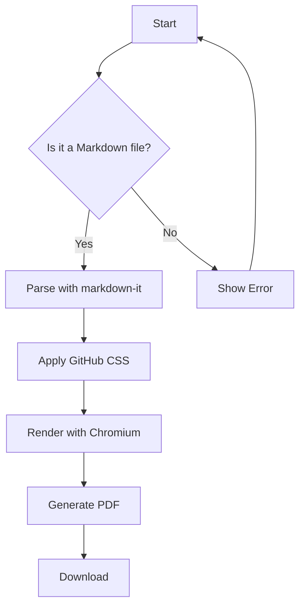
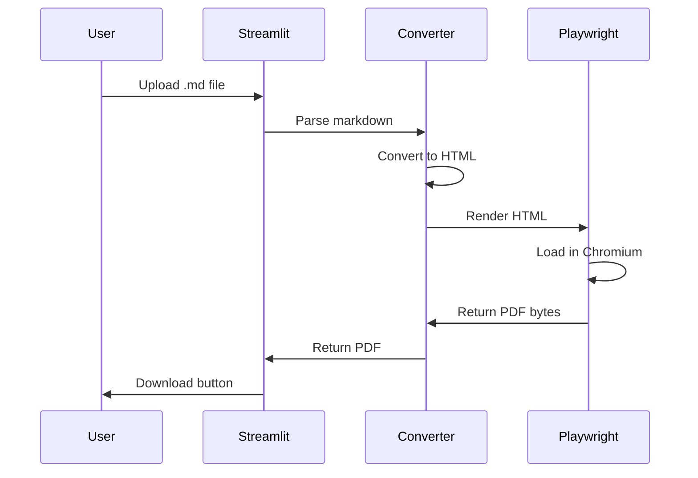

# 🚀 Markdown to PDF — Feature Showcase

This document demonstrates **every feature** supported by the converter.  
It serves as both a test file and a reference.

---

## Table of Contents

- [Typography](#typography)
- [Code Blocks](#code-blocks)
- [Tables](#tables)
- [Task Lists](#task-lists)
- [Blockquotes & Alerts](#blockquotes--alerts)
- [Math Equations](#math-equations)
- [Images & Links](#images--links)
- [Footnotes](#footnotes)
- [Mermaid Diagrams](#mermaid-diagrams)

---

## Typography

### Inline Formatting

This is **bold text**, this is *italic text*, and this is ***bold italic***.  
You can also use ~~strikethrough~~ and `inline code`.

Here's a [link to GitHub](https://github.com) and an autolinked URL: https://example.com

### Headings

# Heading 1
## Heading 2
### Heading 3
#### Heading 4
##### Heading 5
###### Heading 6

### Lists

**Unordered list:**

- Item one
  - Nested item A
  - Nested item B
    - Deep nested
- Item two
- Item three

**Ordered list:**

1. First step
2. Second step
   1. Sub-step 2a
   2. Sub-step 2b
3. Third step

---

## Code Blocks

### Python

```python
import asyncio
from dataclasses import dataclass

@dataclass
class Config:
    """Application configuration."""
    host: str = "localhost"
    port: int = 8080
    debug: bool = False

async def main():
    config = Config(debug=True)
    print(f"Starting server on {config.host}:{config.port}")
    await asyncio.sleep(1)
    return config

if __name__ == "__main__":
    asyncio.run(main())
```

### JavaScript

```javascript
const express = require('express');
const app = express();

// Middleware
app.use(express.json());

app.get('/api/users', async (req, res) => {
  const users = await User.findAll({
    where: { active: true },
    order: [['createdAt', 'DESC']],
  });
  res.json({ success: true, data: users });
});

app.listen(3000, () => console.log('Server running on port 3000'));
```

### Bash

```bash
#!/bin/bash
set -euo pipefail

echo "🔧 Setting up environment..."
python -m venv .venv
source .venv/bin/activate
pip install -r requirements.txt

echo "✅ Setup complete!"
```

### SQL

```sql
SELECT
    u.id,
    u.username,
    COUNT(o.id) AS total_orders,
    SUM(o.amount) AS total_spent
FROM users u
LEFT JOIN orders o ON u.id = o.user_id
WHERE u.created_at >= '2024-01-01'
GROUP BY u.id, u.username
HAVING COUNT(o.id) > 5
ORDER BY total_spent DESC
LIMIT 10;
```

---

## Tables

| Feature          | Status | Priority | Notes                      |
|:-----------------|:------:|:--------:|:---------------------------|
| GFM Tables       |   ✅   |   High   | Fully supported            |
| Syntax Highlight |   ✅   |   High   | Pygments with GitHub theme |
| Math (KaTeX)     |   ✅   |  Medium  | Inline and display math    |
| Mermaid          |   ✅   |  Medium  | Flowcharts, sequences, etc |
| Task Lists       |   ✅   |   Low    | Checkbox rendering         |
| Footnotes        |   ✅   |   Low    | Standard footnote syntax   |

### Complex Table

| Method   | Endpoint        | Description                    | Auth     |
|----------|----------------|--------------------------------|----------|
| `GET`    | `/api/users`    | List all users                 | Required |
| `POST`   | `/api/users`    | Create a new user              | Required |
| `GET`    | `/api/users/:id`| Get user by ID                 | Required |
| `PUT`    | `/api/users/:id`| Update user                    | Required |
| `DELETE` | `/api/users/:id`| Delete user                    | Admin    |

---

## Task Lists

- [x] Project setup and scaffolding
- [x] Implement markdown parser with GFM support
- [x] Add Pygments syntax highlighting
- [x] Integrate KaTeX for math rendering
- [ ] Add dark mode PDF support
- [ ] Implement batch file processing
- [ ] Create REST API endpoint

---

## Blockquotes & Alerts

### Standard Blockquote

> "The best way to predict the future is to invent it."
> — Alan Kay

> **Nested blockquote example:**
>
> > This is a nested blockquote.
> > It supports *all inline formatting*.

### GitHub-Style Alerts

> [!NOTE]
> This is a note alert. Use it to highlight information that users should take into account.

> [!TIP]
> This is a tip alert. Use it for helpful advice and best practices.

> [!IMPORTANT]
> This is an important alert. Use it for crucial information necessary for user success.

> [!WARNING]
> This is a warning alert. Use it for urgent information that needs immediate attention.

> [!CAUTION]
> This is a caution alert. Use it for actions that could cause irreversible consequences.

---

## Math Equations

### Inline Math

The famous equation $E = mc^2$ describes mass–energy equivalence.  
The quadratic formula is $x = \frac{-b \pm \sqrt{b^2 - 4ac}}{2a}$.

### Display Math

$$
\int_{-\infty}^{\infty} e^{-x^2} \, dx = \sqrt{\pi}
$$

$$
\nabla \times \mathbf{E} = -\frac{\partial \mathbf{B}}{\partial t}
$$

$$
\sum_{n=1}^{\infty} \frac{1}{n^2} = \frac{\pi^2}{6}
$$

---

## Images & Links

### Links

- [GitHub](https://github.com)
- [Stack Overflow](https://stackoverflow.com)
- [MDN Web Docs](https://developer.mozilla.org)

### Image


---

## Footnotes

Here is a sentence with a footnote[^1].  
And here's another one with a longer note[^longnote].

[^1]: This is the first footnote.
[^longnote]: This is a longer footnote with multiple paragraphs.

    The second paragraph of the footnote.

---

## Mermaid Diagrams

### Flowchart



### Sequence Diagram



---

## Horizontal Rule Styles

The converter handles all three horizontal rule syntaxes:

---

***

___

---

## Definition Lists & Other Elements

<details>
<summary>Click to expand details</summary>

This is hidden content inside a `<details>` block.

- It supports **all markdown** inside.
- Including `code` and [links](https://example.com).

</details>

### Keyboard Shortcuts

Press <kbd>Ctrl</kbd> + <kbd>Shift</kbd> + <kbd>P</kbd> to open the command palette.

---

*Generated with ❤️ by the Markdown → PDF Converter*
